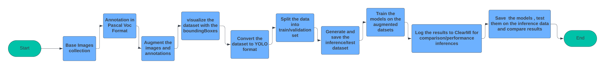

# YOLOv8 Custom Training Handbook

This project aims to provide a scalable model to train YOLOv8 on a custom dataset. It also includes a comparison between different YOLOv8 models (nano, small, medium) using ClearML. The project can be broken down into the following main components/procedures:

- Image and annotations Augmentation to scale the needed dataset
- Converting from the Pascal-VOC formatted dataset to YOLO format
- Splitting the dataset into train, val, test
- Visualizing the dataset Images

## Procedures

- **Base-dataset Collection:** Collect a small-sized dataset (e.g., 25 images) for generating the augmented training dataset.
- **Annotation in Pascal VOC format:** Annotate the target objects (ones, half pounds) in the collected dataset.
- **Augment the images and annotations:** Use `ImageAugmentor.py` to augment the images and their annotations.
- **Visualize the dataset with the bounding boxes:** Use `ImageVisualizer.py` to visualize the images and bounded boxes.
- **Convert the dataset to YOLO format:** Use `YOLO_format_generator.py` to prepare the dataset for YOLO models. This script also generates `dataset.yaml` containing all the needed info about the dataset.
- **Generate the test data:** Use `InferenceDataGenerator.py`.
- **Train the models:** Use `custom_model_training.ipynb`. Train three models (Nano, Small, Medium) and log the results to ClearML. The models were trained with different configurations.
- **Test on inference data:** Use `custom_model_validation_prediction.ipynb` to test the models.

## Project Structure

- `images` folder: contains the raw images before augmentation or annotations
- `annotated_dataset_voc` folder: contains images after annotations in Pascal VOC format
- `augmented_dataset_voc` folder: contains images after augmentation for images and annotations
- `yolo_format_dataset` folder: contains images after augmentation for images and annotations in YOLO format
- `test_dataset` folder: contains augmented images along with annotations in Pascal VOC format
- `test_dataset_yolo` folder: contains augmented images along with annotations in YOLO format
- `helpers`: contains helper classes and modules for augmenting, preparing, and splitting the dataset
- Notebooks for training and validating the models

## Usage

First, set up a virtual environment and install the required modules from `requirements.txt`.

### Helpers

- `ImageAugmentor.py`: Run `python ImageAugmentor.py --help` to see the usage.
- `ImageVisualizer`: Modify the target directory and provide info in the `visualize_images_in_directory` function.
- `YOLO_format_generator` and `InferenceDataGenerator`: Modify `source_directory` and `output_directory`.

### Notebooks

Provide the path for `dataset.yaml` to load the model and initialize ClearML if needed.

## Results and Comparisons

### Results

- Yolov8 nano: final box loss 0.2616, mAP of 0.995
- Yolov8 small: final box loss 0.2608, mAP of 0.995
- Yolov8 medium: final box loss 0.583, mAP of 0.958

### Comparison

The nano and small models performed well despite running for only 30 epochs and low image size. The medium model performed better but was trained for only 5 epochs.

#### Epoch Time

The epoch time for the medium model is significantly longer than for the nano and small models.

#### Parameters

#### mAP50

